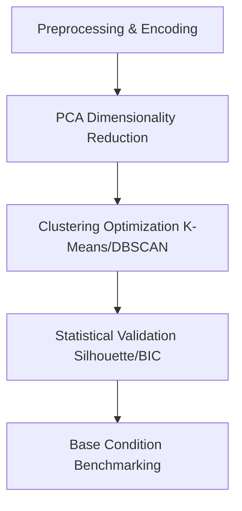

# Strategic Engagement Analysis: Decoding Marketplace Virality

## 📌 Project Overview
This repository contains a data science project designed to identify the structural drivers of engagement within a Facebook Marketplace dataset containing **7,000+ retail records**. Moving beyond basic descriptive statistics, this analysis utilizes a multi-model unsupervised learning framework to segment content behavior and quantify the "viral lift" of different media formats.

### 💡 Core Discovery: The "Vertical Scaling" Effect
The primary finding identifies a distinct **Vertical Scaling** effect in Video content, which achieves engagement multipliers up to **20x higher** than the marketplace baseline. Conversely, static Photos hit a stagnant **Growth Plateau**, failing to scale exponentially regardless of posting frequency.

---

## 🛠️ Key Technical Features

* **Multi-Model Clustering:** Parallel implementation of `K-Means`, `Agglomerative (Hierarchical) Clustering`, and `DBSCAN` to cross-validate and triangulate user behavior patterns.
* **Density-Based Outlier Detection:** Utilized `DBSCAN` to isolate the 29 most viral posts in the dataset, identifying them as distinct, high-impact "Viral Engines" rather than statistical noise.
* **Advanced Statistical Validation:** * Achieved a **Silhouette Score of 0.9184**, indicating exceptionally high cluster density and separation.
    * Optimized model selection using **Bayesian Information Criterion (BIC)** with a score of **-224,898.2**, statistically verifying the 2-cluster probabilistic fit.
* **Relative Performance Matrix:** Engineered a custom "Base Condition" logic to calculate performance multipliers across nine different engagement metrics (including Reactions, Shares, and Loves).

---

## 📈 Strategic Insights

### 1. The Video "Viral Engine"
Analysis shows that Video is the unique format capable of breaking the marketplace engagement ceiling. While present in both standard and elite clusters, Videos in the top segment demonstrated:
* A **15x – 20x Multiplier** in high-effort organic actions (Shares and Loves).
* Superior **Conversion-to-Share** rates compared to all other media types.

### 2. The Photo "Growth Plateau"
Despite being the most frequent content type in the dataset, Photos exhibit a stark localized performance limit:
* Initial entry-level engagement shows a **~84% spike**.
* However, growth remains flat (**1x – 2x**) in viral metrics, completely failing to achieve the exponential scaling seen in Video content.

### 3. Structural Tiering
The marketplace distribution is heavily skewed. It follows a **"Heavy-Tail" distribution** where **~95% of content** resides in a standard baseline, while a tiny, elite segment drives the vast majority of organic reach.

---

## ⚙️ Implementation Workflow

### 1. Preprocessing: Applied One-Hot Encoding to categorical media types followed by robust feature scaling.Dimensionality 
### 2. Reduction: Utilized Principal Component Analysis (PCA) to project high-dimensional behavioral data for optimal visualization and cluster structural integrity.
### 3. Clustering & Optimization: Iteratively tested $k$-values using the Elbow Method, Silhouette Analysis, and BIC optimization.
### 4. Multiplier Analysis: Conducted comparative benchmarking of isolated clusters against a calculated "Base Condition" for each model.

## Repository Structure
├── data/                  # Dataset files (mock/sampled data)
├── notebooks/             # Jupyter Notebooks detailing the step-by-step math & EDA
├── src/                   # Production scripts for preprocessing, scaling, and clustering
├── requirements.txt       # Dependencies needed to run the environment
└── README.md              # Project documentation
